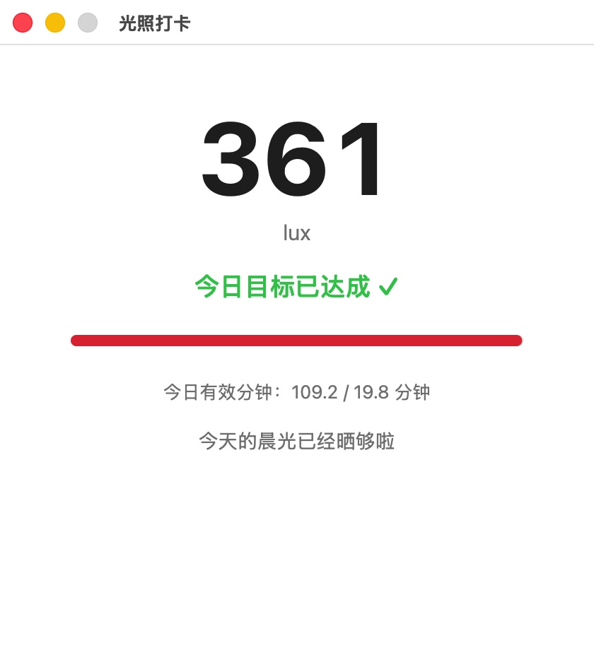

# FirstLight

[中文说明](README.zh-CN.md)

A tiny macOS menu bar app for people correcting a delayed sleep phase
(going to bed and waking up very late) by getting bright light shortly
after waking. It reads your MacBook's built-in light sensor in real
time and tells you whether today's light has been strong enough, for
long enough, to count -- so you don't have to guess or do the math
yourself.

## Install

1. [Download FirstLight.dmg](https://github.com/1c7/FirstLight/releases/latest)
2. Open it, drag `FirstLight.app` into the `Applications` shortcut
3. First launch only: macOS will say "cannot verify the developer" --
   right-click the app and choose **Open** once to get past it

Left-click the lux number in the menu bar to open the main window;
right-click it to quit.