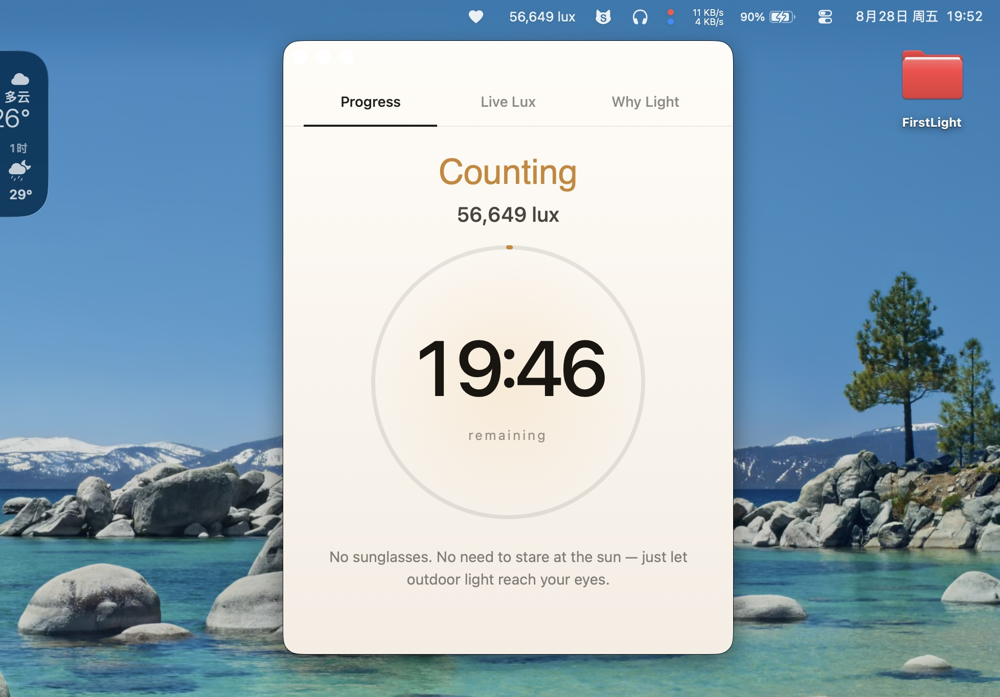
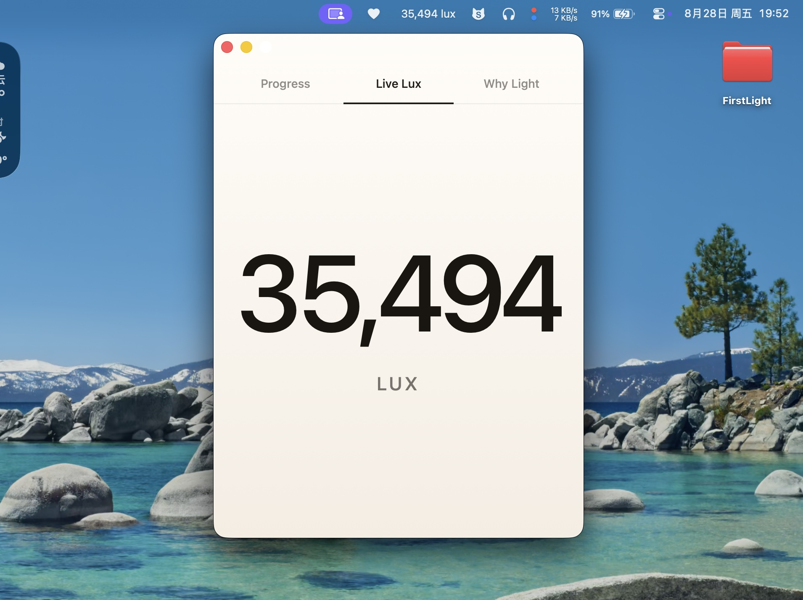
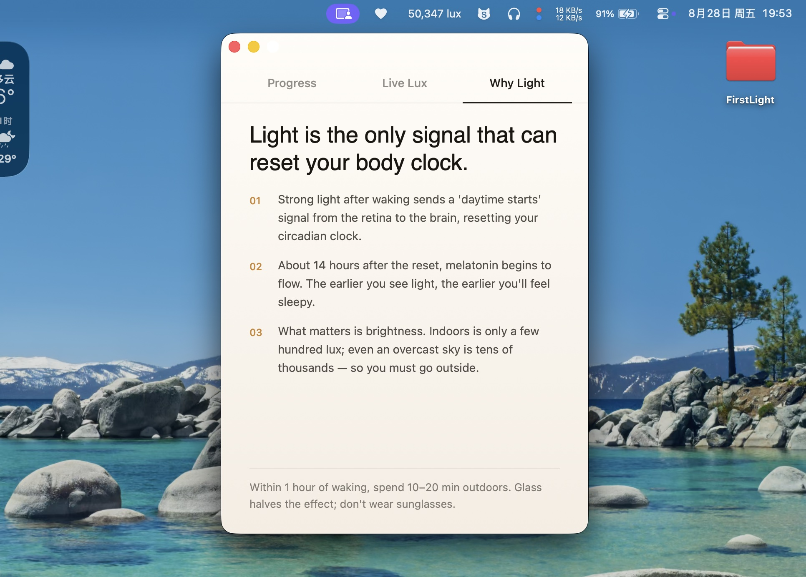

  

# FirstLight

[中文说明](app/doc/README.zh-CN.md)

A tiny macOS utility that lives in your menu bar and opens a dedicated dashboard window to track your morning light exposure in real time.

It reads your MacBook's built-in light sensor to calculate whether today's light exposure has been strong enough, for long enough, to reset your circadian rhythm — so you don't have to guess or do the math yourself.

## Screenshots

## Install & Usage

1. [Download FirstLight.dmg](https://github.com/1c7/FirstLight/releases/latest) and drag `FirstLight.app` into `Applications`.
2. **First launch only**: Right-click the app and choose **Open** to bypass macOS Gatekeeper.
3. **Left-click** the lux reading in the menu bar to open/hide the dashboard window; **right-click** for Settings, About, or Quit. (Supports English & Chinese).

## Compatibility

Requires **macOS 13 or later** on a Mac with a readable built-in ambient-light sensor.

**Confirmed working configuration:**
- MacBook Air (M2, 2022), model identifier `Mac14,2`

*Sensor access relies on the readable but undocumented `CurrentLux` IOKit property. If you test FirstLight on other Mac models, please feel free to report your results! If the sensor is unavailable on your device, use **Debug States → Copy Compatibility Diagnostics** and submit an issue.*

## License

FirstLight is open-sourced under the [MIT License](app/LICENSE).

