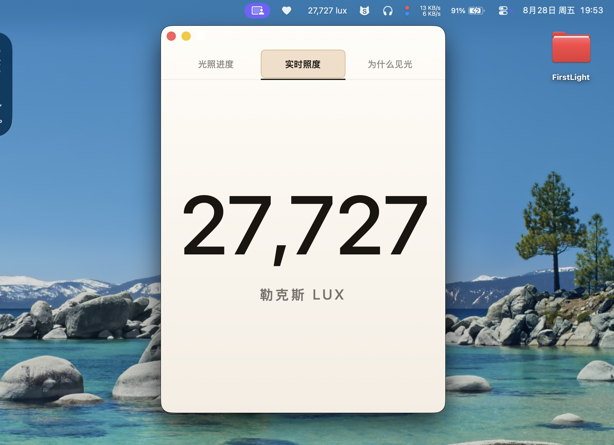
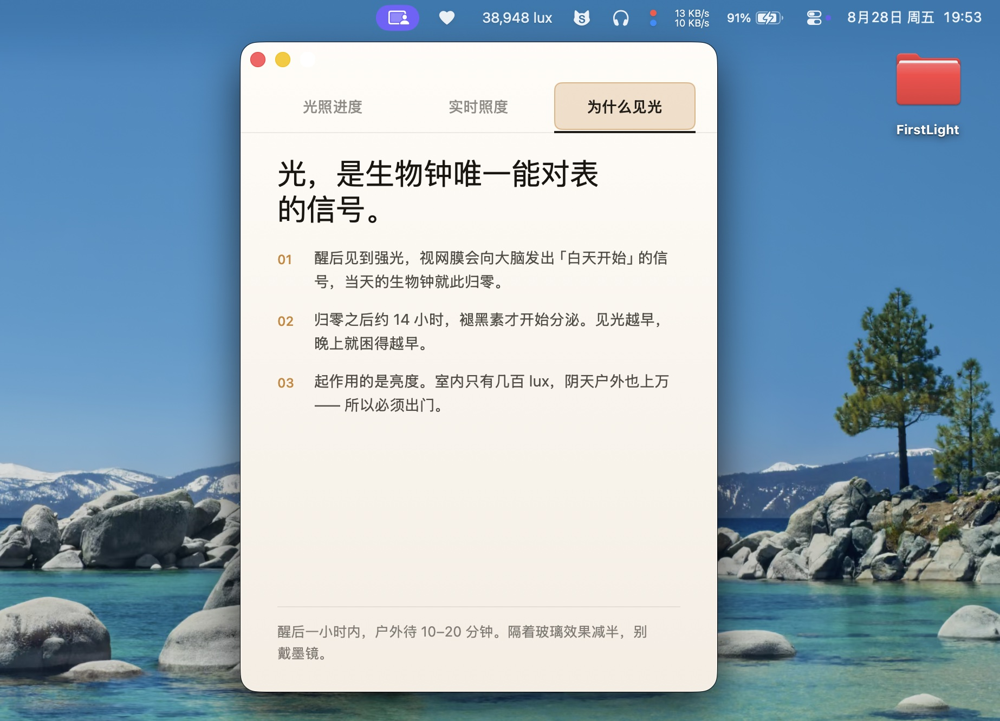

# 产品名称：醒后见光 (FirstLight)

[English](README.md)

## 对你有什么价值？（适合什么人用）
如果你晚睡晚起，想改成早睡早起，方法是醒后尽快去户外见光很重要。可以调整你的生物钟。
本软件是 macOS App，读取 MacBook 内置的光线传感器，告诉你当前是多少 Lux。

## 软件安装后长这样

## 安装

1. [下载 FirstLight.dmg](https://github.com/1c7/FirstLight/releases/latest)
2. 打开磁盘映像，把 `FirstLight.app` 拖进 `Applications` 快捷方式
3. 只有第一次打开会提示"无法验证开发者"——右键点 App 选"打开"绕过一次就好，以后正常双击打开

左键点菜单栏的 lux 数字打开主窗口；右键可打开设置、调试状态或退出。
软件默认跟随 macOS 的语言，也可以在设置中选择“跟随系统”“中文”或“英语”。

## 兼容性

FirstLight 需要 macOS 13 或更高版本，以及一台能读取内置环境光传感器的 Mac。
目前确认测试通过的配置：

- MacBook Air（M2，2022），机型标识符 `Mac14,2`

传感器读取依赖 IOKit 中可读取但未文档化的 `CurrentLux` 属性。软件会先尝试已测试
机型的驱动，再自动搜索其他暴露数值型 `CurrentLux` 属性的驱动。其他机型可能可以
使用，但尚未经过实机验证。如果显示“传感器不可用”，请打开
**调试状态 → 复制兼容性诊断**，提交问题时附上复制出的报告。

## 备注
- [更多文档](doc/README.md)  
- 本软件上线时间：2026 年 8 月 28 号
