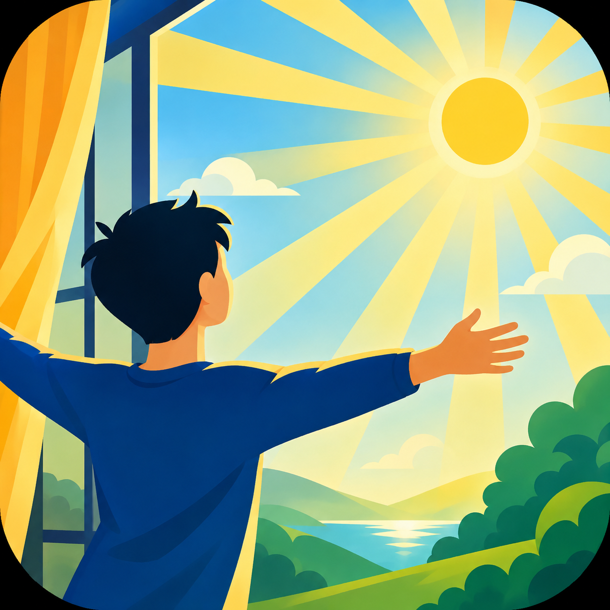

  

# 醒后见光 (FirstLight)

[English](../../README.md)

一款常驻 macOS 菜单栏的轻量工具，专为想调整“晚睡晚起”（睡眠相位后移）作息的人群设计。

它在菜单栏实时显示当前照度，点击即可唤出独立的监控窗口，自动计算你醒后的光照强度与累计有效剂量，直观展示见光达标进度，助你科学重置生物钟 —— 无需手动计时或心算换算。

## 界面预览

## 安装与使用

1. 前往 Release 页面 [下载 FirstLight.dmg](https://github.com/1c7/FirstLight/releases/latest)，打开并将 `FirstLight.app` 拖入 `Applications`（应用程序）文件夹。
2. **首次启动**：右键点击 App 选**“打开”**绕过安全提示，后续直接双击即可运行。
3. **左键点击** 菜单栏 Lux 数值唤出/隐藏独立进度窗口；**右键点击** 呼出设置、调试与退出菜单（默认跟随系统语言，支持手动切换中英文）。

## 兼容性说明

需要 **macOS 13 或更高版本**，以及配有内置环境光传感器的 Mac。

**目前已实机验证通过的机型：**
- MacBook Air（M2，2022），机型标识符 `Mac14,2`

*传感器读取依赖 IOKit 中可读取但未公开文档化的 `CurrentLux` 属性。欢迎在其他机型测试后反馈！若提示“传感器不可用”，请点击 **调试状态 → 复制兼容性诊断** 并提交 Issue。*

## 深入文档

- [同类竞品调研](0-同类竞品调研.md)
- [传感器读取原理](1-传感器读取原理.md)
- [光照剂量计算公式](2-剂量计算公式.md)
- [项目结构与开发说明](3-项目结构与开发说明.md)
- [本地化与界面架构](4-本地化与界面架构.md)

## 开源许可证

本项目基于 [MIT License](../LICENSE) 开源。

